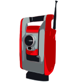

# TOPOSUITE FOR ANDROID

Copyright(C) 2014-2024, CRAG (Commission paritaire  Romande d'Apprentissage de
Géomaticien(ne)s)

TopoSuite for Android is an application developed by Robin Hahling and Kevin
Gillieron, commissioned by the CRAG (Commission paritaire Romande
d'Apprentissage de  Géomaticien(ne)s)

The application development is sponsored by:
* CRAG (Commission Paritaire  Romande d'Apprentissage de Géomaticie(ne)s)
* Swiss Centre for Geomatics Education - https://geo-education.ch/
* Centre d'Enseignement Professionnel de Morges (CEPM) - https://www.cepm.ch
* Centre de Formation Professionnelle Neuchâtelois (CPNE) - https://www.cpne.ch/
* École Professionnelle Commerciale et Artisanale, Sion (EPCA) - https://www.epcasion.ch/
* Professionnels Géomatique Suisse, association (PGS) - https://www.pro-geo.ch/
* Direction du cadastre et de la géoinformation (DCG) - https://www.vd.ch/dcg
* Association Faîtière Géomaticiens / Géomaticiennes Suisse (AFG-CH) - https://www.formation-geomatique.ch/

This application is free software licensed under the GPLv2 license (see
LICENSE). This means that you can freely use, study, redistribute and modify
this program. You must, however, publish any changes to the source code and
make them available under the same license.

## ABOUT

TopoSuite is an application for land surveyors running on Android 11 and later
versions. It is useful for determining new geographical points based on
measurements and it offers various calculations possibilities.

Below is a list of supported calculations:

* Polar calculations
    * station orientation
    * free station
    * polar survey
    * polar implantation
    * axis implantation
* Orthogonal calculations
    * orthogonal survey
    * orthogonal tracking
    * orthogonal implantation
* Intersections calculations
    * lines intersection
    * circles intersections
    * line / circle intersections
* Surfaces calculations
    * surface included with arc of a circle
    * parallel limit displacement regarding compulsory surface
* Miscellaneous
    * field / distance
    * point projection on a line
    * circle computation using three points
    * arc of a circle segmentation
* Mathematics
    * triangle solver
    * circular elements resolution

Data, such as points, may be imported into the application. Supported input
files are CSV, LTOP and PTP. The list of points can be exported to CSV and
shared through e-mail, etc.

It is available in English, French, German and Italian.

## LIMITATIONS

This program has been developed in accordance with rules that are valid for land
surveying in Switzerland (angles are determined in gradian, lengths are in
meters and distance/surface results are rounded to the fourth decimal for
instance).

## CONTRIBUTING

Contributions are welcome. Simple bug fixes or minor improvements should usually
be easily accepted. However, if you plan on adding a major feature, contact us
beforehand so we can make sure that it fits with the overall goals of the
application.

## SPONSORING

This application is free but developers have to eat nonetheless. If you think
this piece of software is useful to you, feel free to contribute by making a
donation. If you feel like a feature is missing and you would like to have it
implemented, consider sponsoring the development of this feature. Several
organizations have already contributed to the development of this application.
Why not yours?
